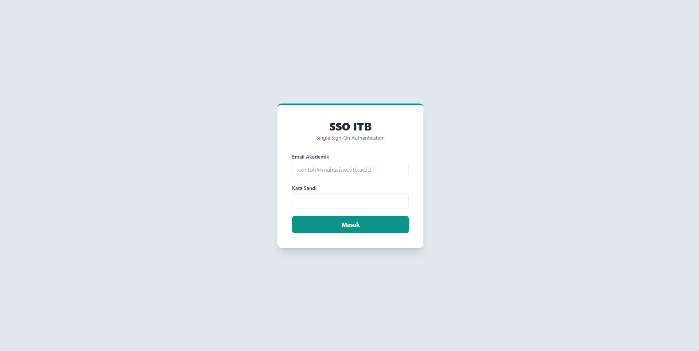
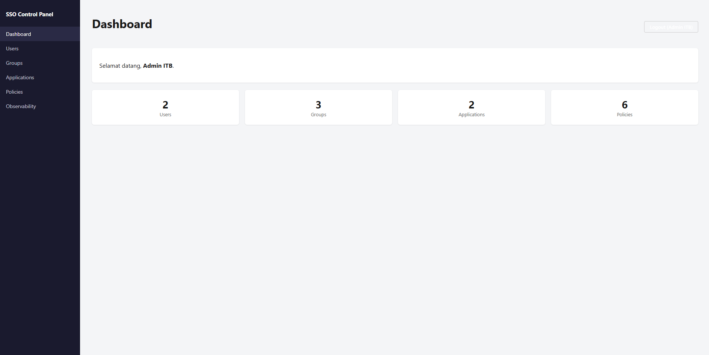
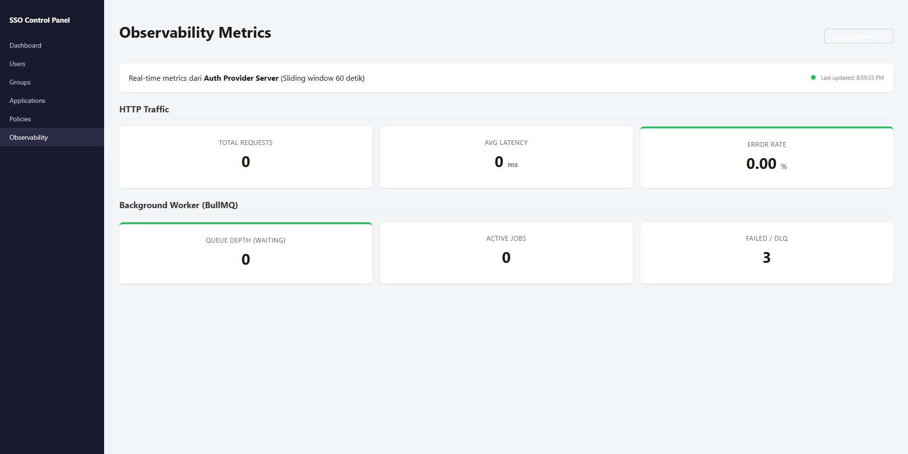
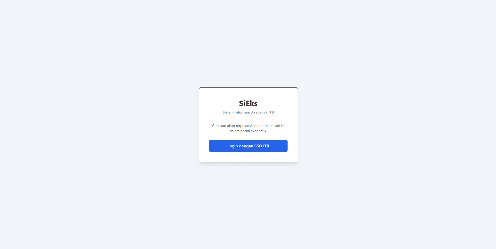
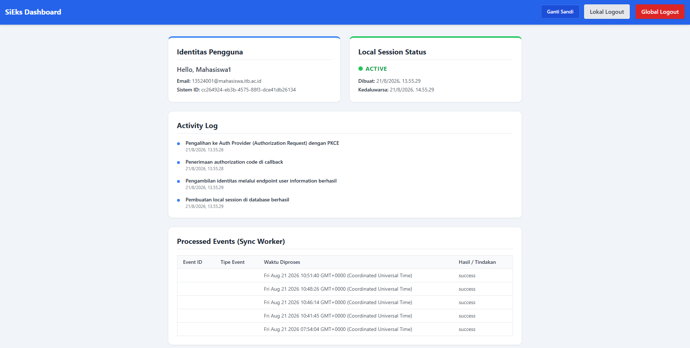
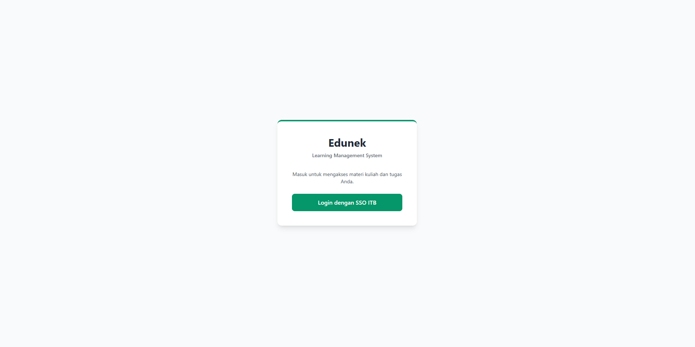
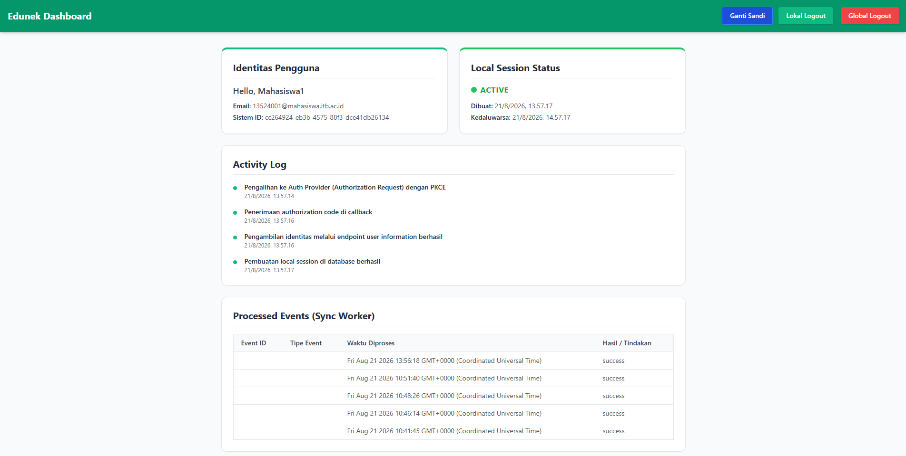

# SSO Identity & Authorization Provider

Tugas Seleksi 2 | Calon Asisten Laboratorium Pemrograman 2026

## 1. Identitas
Nama: Yavie
NIM: 13524077

## 2. Cara Menjalankan Sistem
Proyek ini dapat dijalankan sepenuhnya melalui Docker Compose. Cukup jalankan perintah berikut di root direktori proyek:

```bash
docker compose up -d --build
```

Perintah tersebut akan membangun dan menjalankan seluruh container. Proses inisialisasi database (membuat multiple database), penerapan migrasi skema (npx prisma migrate deploy), dan penyemaian data awal (npx prisma db seed) sudah diotomatisasi pada saat container menyala.

Setelah semua container memiliki status healthy, Anda dapat mengakses komponen sistem pada URL berikut:
- Auth Provider Server: http://localhost:3000
- Control Panel Admin: http://localhost:3010
- Relying App A: http://localhost:3001
- Relying App B: http://localhost:3002

Akun dummy yang dapat digunakan untuk pengujian (dibuat secara otomatis saat seeding):
- Admin: admin@itb.ac.id / Admin123!
- Mahasiswa: 13524001@mahasiswa.itb.ac.id / Mahasiswa123!

## 3. Arsitektur & Alur
Sistem terdiri dari dua entitas utama: Auth Provider Platform dan Relying Applications (App A dan App B). Auth Provider Platform dipisah menjadi komponen sinkron (Auth Server dan Control Panel) dan komponen asinkron (Sync Worker dan Redis). 

Alur sistem:
- Autentikasi dan SSO: User membuka App A dan diarahkan ke Auth Server. Auth Server memverifikasi identitas, membuat Central Session, mengevaluasi kebijakan akses (Policy), lalu mengembalikan Authorization Code. App A menukar kode tersebut dengan Opaque Token di back-channel untuk mendapatkan identitas profil. Jika user membuka App B, Auth Server langsung menerbitkan kode baru tanpa meminta kredensial lagi.
- Sinkronisasi Global Logout: Ketika user menekan global logout di Auth Server, Central Session dicabut. Kemudian Auth Server mempublikasikan event SessionRevoked ke message queue (Redis/BullMQ) menggunakan Outbox Pattern. Sync Worker lalu mengambil event tersebut dan mengirim permintaan pencabutan lokal (webhook) ke endpoint /internal/logout pada App A dan App B.

## 4. Keputusan Teknis
- Pilihan Token (Opaque Token vs JWT): Sistem ini menggunakan Opaque Token. Konsekuensinya, setiap verifikasi token memerlukan lookup ke database. Namun kelebihannya, token dapat langsung dicabut seketika secara mutlak (karena dikendalikan di database pusat), sehingga sangat mendukung mekanisme Global Logout yang tepercaya tanpa jeda waktu kedaluwarsa.
- Pilihan Message Broker: Redis (dengan BullMQ). Dipilih karena performanya yang sangat cepat, ringan, serta stabil untuk ekosistem NodeJS. Sangat cocok untuk penanganan antrean pesan asinkronus (termasuk fitur retry dan dead-letter queue).
- Autentikasi Service-to-Service (/internal/logout): Menggunakan interaksi webhook asinkron. Payload yang dikirim memuat Session ID pusat yang kemudian ditangani secara mandiri dan idempotent oleh masing-masing aplikasi. Pada skala produksi, akses rute ini dilindungi menggunakan aturan jaringan internal (Docker network isolation).
- Pilihan Soft-delete vs Hard-delete: Proyek ini menggunakan Soft-delete dengan merubah status (menjadi inactive atau revoked) pada entitas penting seperti Pengguna dan Aplikasi. Keputusan ini bertujuan untuk mempertahankan rekam jejak historis dan mencegah rusaknya integritas referensial data di database.

## 5. Technology Stack Beserta Versi
- TypeScript: v5.7.3
- NestJS: v11.0.1
- Prisma ORM: v7.9.1
- PostgreSQL: v16 (Alpine image)
- Redis: v7 (Alpine image)
- BullMQ: v5.81.3
- EJS: v6.0.1
- Docker dan Docker Compose

## 6. Daftar Endpoint yang Dibuat

Auth Provider Server:
- GET / : Menampilkan halaman utama SSO
- GET /auth/login : Menampilkan form login
- POST /auth/login : Memproses login dan membuat Central Session
- POST /auth/logout : Memproses Global Logout
- GET /auth/authorize : Melayani alur otorisasi OAuth2 (Authorization Code Flow)
- POST /auth/token : Menukar authorization code menjadi access token
- GET /auth/userinfo : Memberikan informasi profil pengguna
- GET /auth/mfa/setup : Menampilkan halaman pembuatan MFA
- POST /auth/mfa/setup : Memproses setup MFA
- POST /auth/mfa/verify : Memproses verifikasi TOTP MFA
- GET /health : Endpoint untuk Liveness dan Readiness Probe
- GET /metrics : Mengekspos metrik Prometheus

Control Panel Admin:
- GET / : Menampilkan dashboard kontrol panel
- Endpoint Users : GET, POST, PUT, DELETE /users
- Endpoint Groups : GET, POST, PUT, DELETE /groups
- Endpoint Applications : GET, POST, PUT, DELETE /applications
- Endpoint Policies : GET, POST, PUT, DELETE /policies
- GET /observability : Menampilkan dashboard metrik nodejs

Relying Applications (App A dan App B):
- GET / : Menampilkan halaman dashboard aplikasi dan status local session
- GET /auth/login : Mengarahkan pengguna ke Auth Server
- GET /auth/callback : Menerima callback dari Auth Server dan menukar authorization code
- POST /auth/logout : Memproses local logout
- POST /internal/logout : Endpoint webhook asinkron untuk mencabut local session

## 7. Bonus yang Dikerjakan
- B01 (MFA atau WebAuthn): Mendukung autentikasi dua faktor berbasis Time-Based One-Time Password (TOTP) menggunakan authenticator app (Google Authenticator) dan pemindaian kode QR.
- B02 (Observability): Tersedia dashboard pemantauan pada Control Panel untuk memonitor metrik kesehatan layanan (diekspos melalui prometheus metrics).
- B03 (Liveness dan Readiness Probe): Endpoint /health diterapkan pada layanan utama untuk verifikasi kesehatan dan kesiapan sistem.
- B04 (Graceful Shutdown): Diaktifkan secara native di nestjs sehingga koneksi diputus secara aman saat server dimatikan.

## 8. Screenshot

**Auth Provider Server**
- Halaman Login SSO:
  

**Control Panel Admin**
- Dashboard Control Panel:
  
- Dashboard Observability:
  

**Relying Application A (SiEks)**
- Halaman Login App A:
  
- Dashboard App A:
  

**Relying Application B (Edunek)**
- Halaman Login App B:
  
- Dashboard App B:
  
